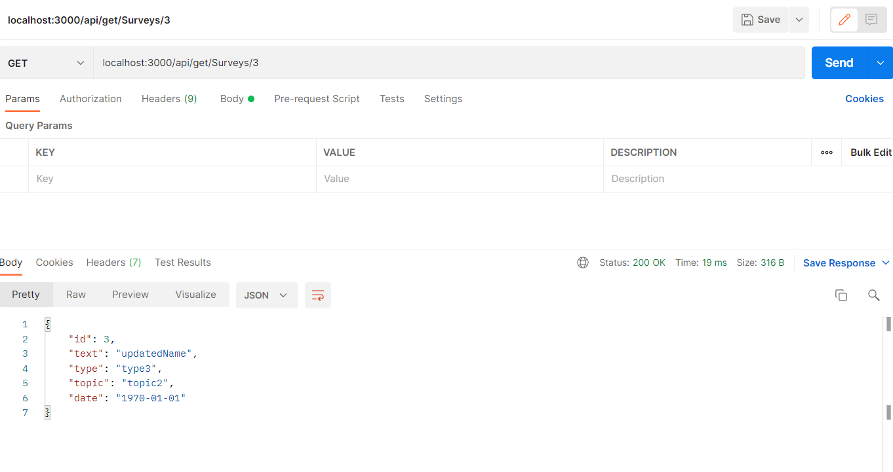
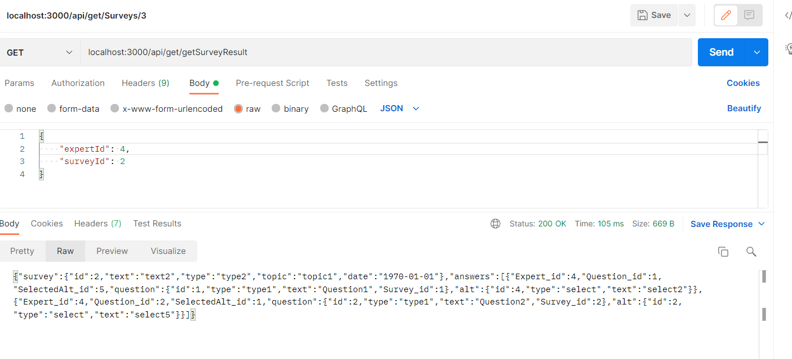
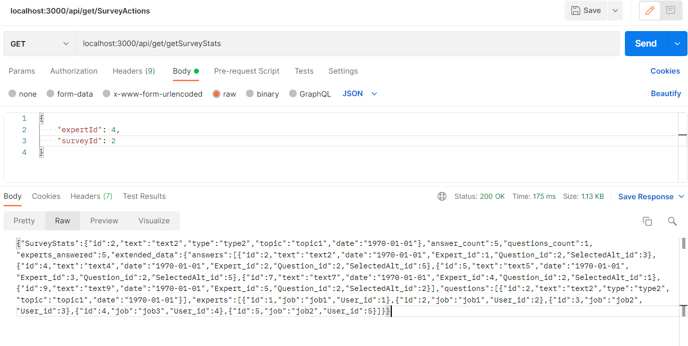
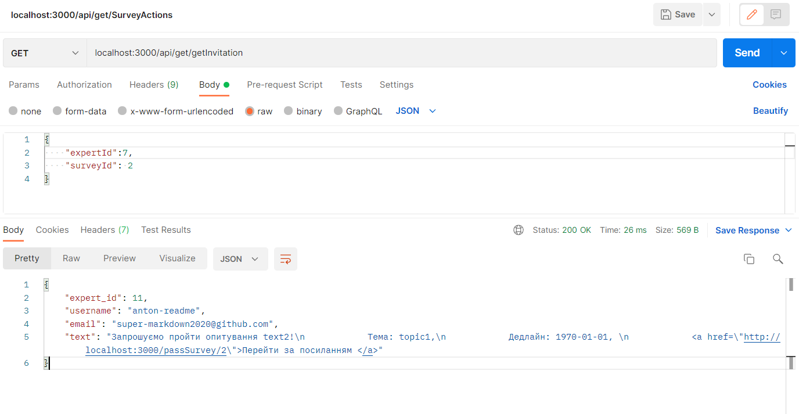
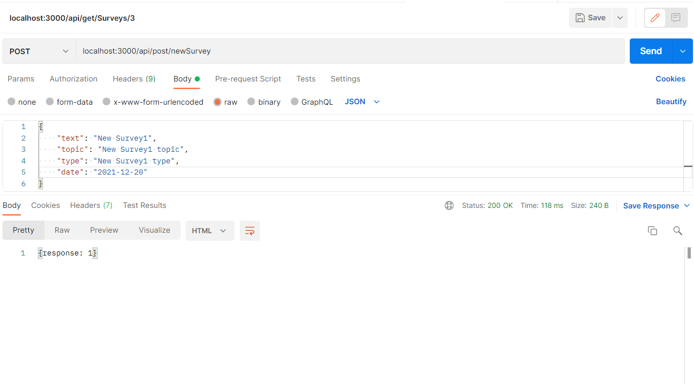
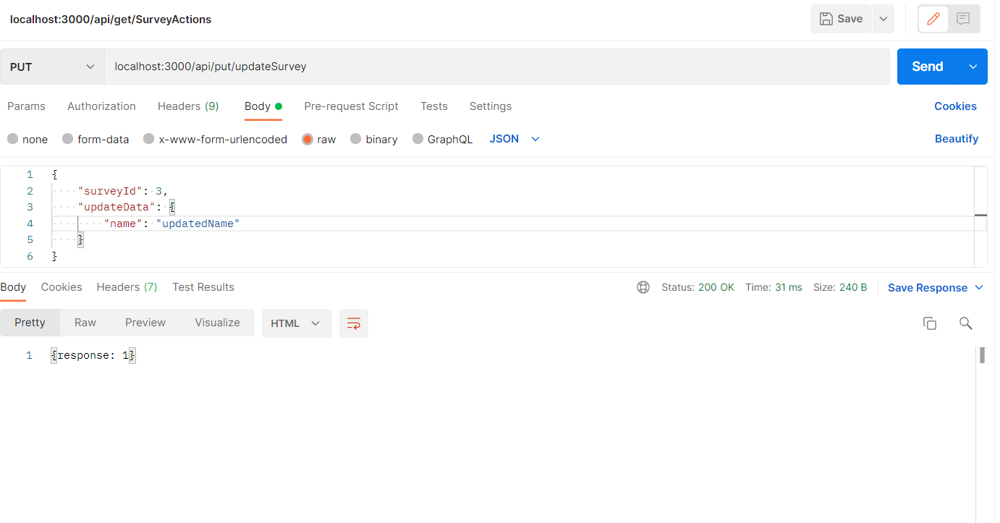

# Тестування працездатності системи

# Тестування працездатності системи
- `/api/get/[model.name]s/:id` - Отримати модель за ID

- `/api/get/getSurveyResult` - Отримати результат опитування для опитування за ID екперта та опитування

- `/api/get/getSurveyStats` - Отримати статистику для опитування за ID

- `/api/get/getInvitation` - Отримати запрошення для експерта за його ID

- `/api/post/newSurvey` - Нове опитування (text, type, topic, date)

- `/api/put/updateSurvey` - Оновити дані про опитування (Survey_id, updateData: {object extends newSurveyData})

